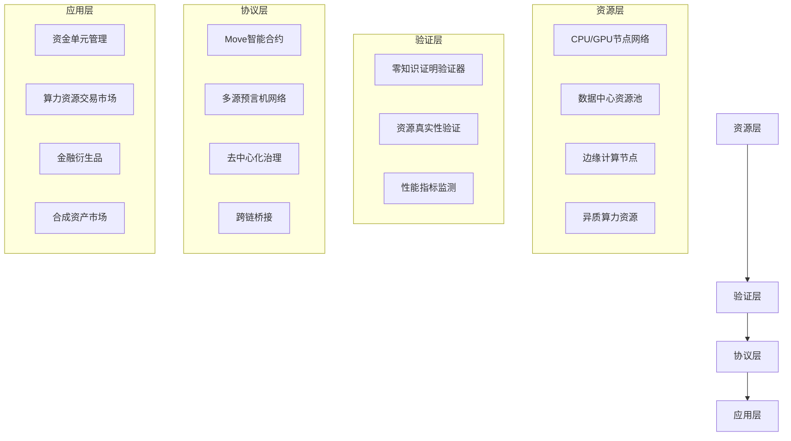
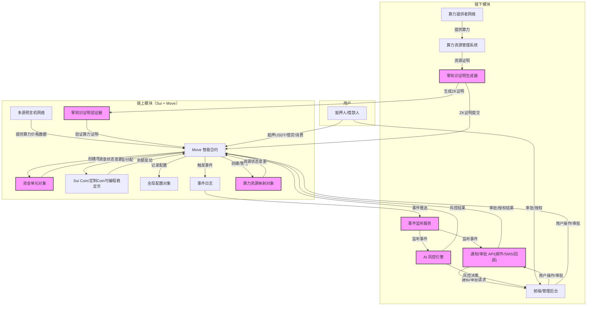

# USDH：基于 Sui 区块链的算力资源支持可编程稳定币系统技术设计

## 总体架构概览

系统基于 Sui 区块链，采用 Move 语言编写智能合约，结合零知识证明技术和去中心化预言机网络，将分布式算力资源与稳定币技术深度融合，创建一个可编程的数字货币生态系统。USDH 系统不仅提供价值存储媒介，还将闲置算力资源代币化，解决了算力市场流动性低、定价不透明和资源浪费的行业痛点。

系统运作流程：
1. 用户将 USDT/USDC 等稳定币抵押到平台
2. 平台购买或租赁对应价值的标准化算力资源
3. 算力资源通过零知识证明验证后在链上生成映射凭证
4. 发行等值的可编程稳定币（USDH, Hashrate-backed USD）给用户
5. 当算力资源价值变动时，系统通过预言机数据自动调整储备和抵押率要求

每个"资金单元"作为通用的可编程资金管理机制，能够对资金流向、使用条件和授权规则进行精确控制。系统记录所有者、公钥、金额、用途限制、释放时间等属性，并引入零知识证明实现隐私保护的资金控制。

系统采用四层分层设计，确保稳定性、可扩展性和安全性：



总的来说，系统分为链上模块（Move 合约、算力资源映射、资金单元对象、Sui Coin）和链下模块（算力资源提供者、零知识证明生成、事件监听器、通知/审批 API、AI 风控），共同协同实现灵活可控的资金使用流程和算力资源管理。



## Sui 区块链特性优势

USDH 系统选择 Sui 区块链作为底层基础设施，主要基于以下优势：

### 1. 对象模型与所有权系统

Sui 的对象模型完美适配 USDH 的资产和资金单元模型：

- **直接对象所有权**：每个资金单元和算力资源都是链上直接拥有的对象，而非 PDA 派生账户
- **精确对象状态追踪**：对象可以准确追踪算力资产的状态和所有权变更
- **动态字段扩展**：可以为对象动态添加字段，支持灵活的资源属性扩展
- **能力模型安全**：Move 语言的能力模型确保只有授权方能修改对象状态

### 2. 并行执行引擎

Sui 的并行执行特性显著提高了 USDH 系统性能：

- **高吞吐量**：可处理大量并发交易，满足大规模算力市场需求
- **即时确定性**：交易确认更快，提供更实时的市场数据和响应
- **独立对象操作**：不相关的资金单元和算力资源交易可以并行处理
- **可扩展性**：随着网络增长，系统性能线性扩展

### 3. Move 语言安全特性

Move 语言为 USDH 提供了更强的安全保障：

- **形式化验证**：支持合约代码的形式化验证，减少安全漏洞
- **类型安全**：强类型系统减少运行时错误
- **资源线性化**：资源不能被复制或隐式丢弃，只能被移动
- **泛型支持**：更灵活地构建复杂金融产品和资源类型

### 4. 系统扩展性

Sui 架构为 USDH 提供了卓越的扩展性：

- **动态字段**：无需修改合约即可扩展对象属性
- **自定义事件**：灵活定义和发布事件，支持复杂的链下系统集成
- **模块化设计**：支持系统功能的模块化开发和升级
- **跨链互操作**：高性能跨链桥接架构，支持多链资产整合

## 多层次资产支持模型

为构建稳健的算力支持型稳定币，USDH系统采用多层次资产支持模型，结合了传统抵押、算力资产和合成资产的优势：

### 锚定机制解析

| 资产支持层级             | 本质特征                                     | 实现机制                                           | 用户权益                                |
| ------------------------ | -------------------------------------------- | -------------------------------------------------- | --------------------------------------- |
| **第一层：稳定币抵押层** | 债务型锚定，平台对用户有等额稳定币的偿付义务 | 合约记录用户抵押的USDT/USDC数量，与USDH形成1:1映射 | 可随时赎回原始抵押的稳定币（按1:1比例） |
| **第二层：算力资源层**   | 资产型锚定，USDH代表对等价值的算力使用权     | 平台用抵押的稳定币购买/租赁算力，生成ZK证明        | 可按当前预言机价格赎回等值算力使用权    |
| **第三层：合成资产层**   | 金融衍生品锚定，增强流动性和价值捕获         | 基于算力资产构建的衍生品，如期货、期权和收益率产品 | 可参与算力金融市场，获取额外收益        |
| **第四层：跨链抵押层**   | 多链资产支持，提高系统稳定性和可扩展性       | 支持多链资产作为额外抵押，通过跨链桥接实现         | 可使用多链资产进行抵押，提高资本效率    |

这种多层架构确保了USDH既有传统稳定币的价格稳定性，又具备实用价值算力资产的增值潜力和使用价值，并通过合成资产提供丰富的金融衍生功能。

### 多层资产支持数据结构

系统引入 `AssetBacking` 结构，明确记录每批 USDH 铸造的多层资产支持数据：

```move
struct AssetBacking has key, store {
    id: UID,
    batch_id: u64,                // 铸造批次唯一标识  
    stable_reserve: u64,          // 该批次锁定的稳定币数量
    hashrate_resource_ids: vector<ID>, // 对应算力资源的ID列表
    synthetic_asset_ids: vector<ID>,   // 关联合成资产ID列表
    cross_chain_collateral: vector<CrossChainAsset>, // 跨链抵押资产
    mint_time: u64,               // 铸造时间
    backing_ratio: u16,           // 资产覆盖率（基点，10000=100%）
    risk_adjustment_factor: u16,  // 风险调整因子
    is_redeemable_for_stable: bool, // 稳定币赎回通道是否开启
    is_redeemable_for_hashrate: bool, // 算力赎回通道是否开启
}

struct CrossChainAsset has store {
    chain_id: u16,                // 链ID
    asset_type: u8,               // 资产类型
    amount: u64,                  // 资产数量
    address: vector<u8>,          // 资产地址
    proof: ID,                    // 跨链证明
}

// 使用常量代替枚举
const ASSET_TYPE_TOKEN: u8 = 0;
const ASSET_TYPE_NFT: u8 = 1;
const ASSET_TYPE_SYNTHETIC_ASSET: u8 = 2;
const ASSET_TYPE_LIQUIDITY_POSITION: u8 = 3;
```

### 多路径赎回流程

系统提供多种赎回接口满足不同用户需求：

#### 稳定币赎回路径 

```move
public fun redeem_stable(
    asset_backing: &mut AssetBacking,
    usdh_coin: Coin<USDH>,
    stable_type: TypeName,
    ctx: &mut TxContext
): Coin<T> {
    // 验证参数和权限
    let usdh_amount = coin::value(&usdh_coin);
    assert!(usdh_amount > 0, EInvalidAmount);
    assert!(asset_backing.is_redeemable_for_stable, ERedemptionNotAvailable);
    
    // 销毁USDH
    let treasury = &mut borrow_global_mut<Treasury>(TREASURY_ADDRESS);
    coin::destroy_zero(coin::extract(&mut usdh_coin, usdh_amount));
    
    // 从储备中释放稳定币
    let redeemed_stable = treasury::withdraw_stable<T>(
        treasury, 
        usdh_amount,
        ctx
    );
    
    // 更新资产支持记录
    asset_backing.stable_reserve = asset_backing.stable_reserve - usdh_amount;
    
    // 发出赎回事件
    event::emit(RedeemStableEvent {
        user: tx_context::sender(ctx),
        usdh_amount,
        stable_type,
        timestamp: tx_context::epoch_timestamp_ms(ctx),
    });
    
    redeemed_stable
}
```

#### 算力资源赎回路径

```move
public fun redeem_hashrate(
    asset_backing: &mut AssetBacking,
    usdh_coin: Coin<USDH>,
    resource_id: ID,
    duration: u64,
    ctx: &mut TxContext
): HashrateUsageRight {
    // 验证参数
    assert!(asset_backing.is_redeemable_for_hashrate, ERedemptionNotAvailable);
    assert!(vector::contains(&asset_backing.hashrate_resource_ids, &resource_id), EResourceNotFound);
    
    // 获取算力资源价值
    let resource = object::borrow<HashrateResource>(resource_id);
    let oracle = &borrow_global<OracleData>(ORACLE_ADDRESS);
    let resource_value = oracle::get_hashrate_value(oracle, resource, duration);
    
    // 验证USDH金额
    let usdh_amount = coin::value(&usdh_coin);
    assert!(usdh_amount >= resource_value, EInsufficientFunds);
    
    // 销毁USDH
    coin::destroy_zero(coin::extract(&mut usdh_coin, resource_value));
    
    // 创建使用权凭证
    let usage_right = hashrate_resource::create_usage_right(
        resource_id,
        duration,
        tx_context::sender(ctx),
        ctx
    );
    
    // 发出赎回事件
    event::emit(RedeemHashrateEvent {
        user: tx_context::sender(ctx),
        resource_id,
        duration,
        usdh_amount: resource_value,
        timestamp: tx_context::epoch_timestamp_ms(ctx),
    });
    
    usage_right
}
```

#### 合成资产赎回路径

```move
public fun redeem_synthetic(
    asset_backing: &mut AssetBacking,
    usdh_coin: Coin<USDH>,
    synthetic_id: ID,
    ctx: &mut TxContext
): SyntheticAsset {
    // 验证参数
    assert!(vector::contains(&asset_backing.synthetic_asset_ids, &synthetic_id), EAssetNotFound);
    
    // 获取合成资产价值
    let synthetic = object::borrow<SyntheticAsset>(synthetic_id);
    let oracle = &borrow_global<OracleData>(ORACLE_ADDRESS);
    let synthetic_value = oracle::get_synthetic_value(oracle, synthetic);
    
    // 验证USDH金额
    let usdh_amount = coin::value(&usdh_coin);
    assert!(usdh_amount >= synthetic_value, EInsufficientFunds);
    
    // 销毁USDH
    coin::destroy_zero(coin::extract(&mut usdh_coin, synthetic_value));
    
    // 转移合成资产所有权
    let synthetic_asset = synthetic_market::acquire_synthetic_asset(
        synthetic_id,
        tx_context::sender(ctx),
        ctx
    );
    
    // 从资产支持中移除合成资产ID
    let index = vector::index_of(&asset_backing.synthetic_asset_ids, &synthetic_id);
    if (option::is_some(&index)) {
        vector::remove(&mut asset_backing.synthetic_asset_ids, *option::borrow(&index));
    };
    
    // 发出赎回事件
    event::emit(RedeemSyntheticEvent {
        user: tx_context::sender(ctx),
        synthetic_id,
        usdh_amount: synthetic_value,
        timestamp: tx_context::epoch_timestamp_ms(ctx),
    });
    
    synthetic_asset
}
```

### 零知识验证的自适应稳定机制

USDH采用先进的自适应稳定机制，维持其与美元的1:1锚定：

#### 动态抵押率调整

```move
public fun adjust_collateral_ratio(
    config: &mut GlobalConfig,
    oracle: &OracleData,
    ctx: &mut TxContext
) {
    // 获取当前市场数据
    let market_volatility = oracle::get_market_volatility(oracle);
    let target_ratio = calculate_optimal_collateral_ratio(
        market_volatility, 
        config.base_collateral_ratio,
        config.max_collateral_ratio,
        config.min_collateral_ratio
    );
    
    // 验证计算结果的零知识证明
    let proof = option::extract(&mut config.pending_ratio_proof);
    assert!(
        zk_verifier::verify_ratio_calculation(proof, market_volatility, target_ratio),
        EInvalidZkProof
    );
    
    // 更新抵押率
    config.current_collateral_ratio = target_ratio;
    
    // 发出抵押率更新事件
    event::emit(CollateralRatioUpdateEvent {
        old_ratio: config.current_collateral_ratio,
        new_ratio: target_ratio,
        market_volatility,
        timestamp: tx_context::epoch_timestamp_ms(ctx),
    });
}
```

#### 分层算力储备池

```move
struct HashrateReservePool has key {
    id: UID,
    risk_tier: u8,            // 风险等级
    resources: vector<ID>,    // 池中资源ID
    total_compute_power: u64, // 总计算能力
    liquidity_score: u16,     // 流动性评分
    stability_score: u16,     // 稳定性评分
    utilization_rate: u16,    // 使用率（基点）
    last_audit_time: u64,     // 最近审计时间
    audit_proof: Option<vector<u8>>, // 零知识审计证明
}

// 风险等级常量
const RISK_TIER_LOW: u8 = 1;
const RISK_TIER_MEDIUM: u8 = 2;
const RISK_TIER_HIGH: u8 = 3;
```

#### 反周期费率机制

```move
public fun calculate_fee_rate(
    config: &GlobalConfig,
    oracle: &OracleData,
): u16 {
    // 获取市场指标
    let demand_index = oracle::get_market_demand_index(oracle);
    let supply_growth_rate = calculate_supply_growth_rate(config);
    
    // 基础费率
    let base_fee = config.base_fee_rate;
    
    // 市场需求调整
    let demand_adjustment = if (demand_index > config.high_demand_threshold) {
        // 高需求，提高费率以控制供应增长
        let excess = demand_index - config.high_demand_threshold;
        let adjustment = (excess * config.demand_fee_multiplier) / 10000;
        base_fee + adjustment
    } else if (demand_index < config.low_demand_threshold) {
        // 低需求，降低费率以鼓励使用
        let deficit = config.low_demand_threshold - demand_index;
        let adjustment = (deficit * config.demand_fee_multiplier) / 10000;
        if (adjustment >= base_fee) {
            config.min_fee_rate
        } else {
            base_fee - adjustment
        }
    } else {
        // 正常需求区间
        base_fee
    };
    
    // 确保费率在合理范围内
    math::max(config.min_fee_rate, math::min(demand_adjustment, config.max_fee_rate))
}
```

#### 流动性激励系统

```move
struct LiquidityIncentive has key {
    id: UID,
    price_range_min: u64,     // 价格区间下限
    price_range_max: u64,     // 价格区间上限
    reward_multiplier: u16,   // 奖励倍数（基点）
    total_liquidity: u64,     // 总流动性
    providers: Table<address, u64>, // 提供者 -> 提供量
    is_critical_range: bool,  // 是否为关键价格区间
    last_update_time: u64,    // 最近更新时间
}

public fun distribute_liquidity_rewards(
    incentive: &mut LiquidityIncentive,
    reward_pool: &mut RewardPool,
    ctx: &mut TxContext
) {
    let current_time = tx_context::epoch_timestamp_ms(ctx);
    let time_elapsed = current_time - incentive.last_update_time;
    
    // 至少每小时计算一次奖励
    if (time_elapsed >= HOUR_IN_MS) {
        let providers = &incentive.providers;
        let reward_rate = if (incentive.is_critical_range) {
            // 关键价格区间额外奖励
            reward_pool.base_reward_rate * incentive.reward_multiplier / 10000
        } else {
            reward_pool.base_reward_rate
        };
        
        // 计算每个提供者的奖励
        let i = 0;
        let keys = table::keys(providers);
        let len = vector::length(&keys);
        
        while (i < len) {
            let provider = *vector::borrow(&keys, i);
            let liquidity_provided = *table::borrow(providers, provider);
            let share = (liquidity_provided * 10000) / incentive.total_liquidity;
            let reward_amount = (reward_pool.available_rewards * share * reward_rate) / (10000 * 10000);
            
            if (reward_amount > 0) {
                // 发放奖励
                reward_pool::distribute_reward(
                    reward_pool,
                    provider,
                    reward_amount,
                    ctx
                );
            };
            
            i = i + 1;
        };
        
        incentive.last_update_time = current_time;
    }
}
```

## 算力贡献挖矿机制设计

USDH系统通过算力贡献挖矿(Compute-to-Earn)机制，为算力提供者创建直接赚取USDH稳定币的路径，形成完整的生态闭环。本章详细设计该机制的技术实现与经济模型。

### 1. 算力资源注册与验证框架

#### 1.1 算力资源身份与凭证系统

系统采用多层次身份验证与凭证系统确保算力资源的真实性与可靠性：

```move
/// 算力资源身份凭证
struct ComputeResourceCredential has key {
    id: UID,                       // 对象唯一ID
    resource_id: ID,               // 资源唯一标识
    provider_id: address,          // 提供者身份
    resource_type: u8,             // 资源类型(GPU/CPU等)
    specs: ResourceSpecification,  // 硬件规格详情
    performance_baseline: ResourcePerformance, // 基准性能指标
    verification_proofs: vector<ID>, // 验证证明记录
    registration_time: u64,        // 注册时间戳
    last_verification_time: u64,   // 最近验证时间
    credibility_score: u16,        // 信誉评分(0-10000)
    status: u8,                    // 当前状态
    nft_mint: Option<ID>,          // 关联NFT Mint
}

/// 资源规格详情
struct ResourceSpecification has store {
    // GPU资源规格
    gpu_model: Option<String>,     // GPU型号
    gpu_count: Option<u8>,         // GPU数量
    vram_gb: Option<u16>,          // 显存大小(GB)
    cuda_cores: Option<u32>,       // CUDA核心数
    tensor_cores: Option<u32>,     // Tensor核心数
    
    // CPU资源规格
    cpu_model: Option<String>,     // CPU型号
    cpu_cores: Option<u16>,        // CPU核心数
    cpu_threads: Option<u16>,      // CPU线程数
    cpu_frequency_mhz: Option<u32>, // CPU频率(MHz)
    
    // 内存与存储规格
    ram_gb: Option<u16>,           // 内存大小(GB)
    storage_gb: Option<u32>,       // 存储大小(GB)
    storage_type: Option<u8>,      // 存储类型
    
    // 网络规格
    network_bandwidth_mbps: Option<u32>, // 网络带宽(Mbps)
    
    // 其他规格拓展
    additional_specs: Option<String>, // JSON格式的附加规格
}

/// 资源性能指标
struct ResourcePerformance has store {
    flops: Option<u64>,            // 浮点运算性能(FLOPS)
    ai_ops: Option<u64>,           // AI运算性能
    bandwidth_gbps: Option<u32>,   // 内存带宽(GBps)
    latency_ms: Option<u16>,       // 响应延迟(ms)
    energy_efficiency: Option<u16>, // 能效比(FLOPS/W)
    benchmark_scores: Table<String, u32>, // 各类基准测试分数
}

// 资源状态常量
const STATUS_ACTIVE: u8 = 0;        // 活跃状态
const STATUS_PENDING: u8 = 1;       // 等待验证
const STATUS_MAINTENANCE: u8 = 2;   // 维护中
const STATUS_SUSPENDED: u8 = 3;     // 暂停服务
const STATUS_TERMINATED: u8 = 4;    // 终止服务

// 资源类型常量
const RESOURCE_TYPE_GPU: u8 = 0;
const RESOURCE_TYPE_CPU: u8 = 1;
const RESOURCE_TYPE_TPU: u8 = 2;
const RESOURCE_TYPE_FPGA: u8 = 3;
const RESOURCE_TYPE_ASIC: u8 = 4;
const RESOURCE_TYPE_HYBRID_COMPUTE: u8 = 5;
const RESOURCE_TYPE_QUANTUM_SIMULATOR: u8 = 6;
const RESOURCE_TYPE_CUSTOM: u8 = 7;

// 存储类型常量
const STORAGE_TYPE_SSD: u8 = 0;
const STORAGE_TYPE_NVME: u8 = 1;
const STORAGE_TYPE_HDD: u8 = 2;
const STORAGE_TYPE_DISTRIBUTED_STORAGE: u8 = 3;
const STORAGE_TYPE_CUSTOM: u8 = 4;
```

#### 1.2 零知识验证协议

系统设计了专用的零知识证明电路，用于验证算力资源的真实性和性能。零知识证明验证流程如下：

```move
/// 验证记录结构
struct VerificationRecord has store {
    timestamp: u64,
    verifier: address,
    proof_hash: vector<u8>,
    result: u8,
    details: Option<String>,
}

// 验证结果常量
const VERIFICATION_SUCCESS: u8 = 0;
const VERIFICATION_PARTIAL_SUCCESS: u8 = 1;
const VERIFICATION_FAILURE: u8 = 2;

/// 提交验证结果
public fun submit_verification_result(
    credential: &mut ComputeResourceCredential,
    proof: vector<u8>,
    result: u8,
    details: Option<String>,
    ctx: &mut TxContext
) {
    // 检查调用者是否为授权验证者
    let sender = tx_context::sender(ctx);
    assert!(is_authorized_verifier(sender), ENotAuthorizedVerifier);
    
    // 创建验证记录
    let record = VerificationRecord {
        timestamp: tx_context::epoch_timestamp_ms(ctx),
        verifier: sender,
        proof_hash: proof,
        result,
        details
    };
    
    // 计算验证影响
    if (result == VERIFICATION_SUCCESS) {
        credential.credibility_score = calculate_new_score(
            credential.credibility_score, 
            true, 
            100
        );
    } else if (result == VERIFICATION_PARTIAL_SUCCESS) {
        let impact = if (option::is_some(&details)) {
            parse_partial_success_impact(&option::extract(&mut details))
        } else {
            50
        };
        credential.credibility_score = calculate_new_score(
            credential.credibility_score, 
            true, 
            impact
        );
    } else {
        credential.credibility_score = calculate_new_score(
            credential.credibility_score, 
            false, 
            0
        );
    };
    
    // 更新状态
    credential.last_verification_time = tx_context::epoch_timestamp_ms(ctx);
    
    // 将验证结果转换为对象并存储ID
    let verification_proof_obj = create_verification_proof(record, ctx);
    let proof_id = object::id(&verification_proof_obj);
    vector::push_back(&mut credential.verification_proofs, proof_id);
    
    // 转移对象所有权
    transfer::share_object(verification_proof_obj);
    
    // 发布验证事件
    event::emit(ResourceVerificationEvent {
        resource_id: credential.resource_id,
        verifier: sender,
        result,
        timestamp: tx_context::epoch_timestamp_ms(ctx),
    });
}
```

#### 1.3 资源凭证NFT

系统为验证通过的算力资源铸造唯一的算力资源凭证NFT，作为资源注册和奖励分配的基础：

```move
struct ComputeResourceNFT has key {
    id: UID,                      // 对象唯一ID
    resource_id: ID,              // 对应算力资源ID
    provider: address,            // 提供者地址
    resource_type: u8,            // 资源类型
    performance_tier: u8,         // 性能等级(1-5)
    issuance_time: u64,           // 发行时间戳
    expiration_time: u64,         // 到期时间戳
    uri: String,                  // 元数据URI
    compute_power_unit: u64,      // 计算能力单位
    verification_history: vector<VerificationRecord>, // 验证历史
    name: String,                 // NFT名称
    description: String,          // NFT描述
    image_url: String,            // NFT图像URL
}

/// 铸造资源凭证NFT
public fun mint_resource_nft(
    credential: &ComputeResourceCredential,
    name: String,
    description: String,
    image_url: String,
    ctx: &mut TxContext
): ComputeResourceNFT {
    // 检查资源是否已通过验证
    assert!(credential.status == STATUS_ACTIVE, EResourceNotActive);
    assert!(credential.credibility_score >= MIN_CREDIBILITY_SCORE, ELowCredibilityScore);
    
    // 创建NFT
    let nft = ComputeResourceNFT {
        id: object::new(ctx),
        resource_id: credential.resource_id,
        provider: credential.provider_id,
        resource_type: credential.resource_type,
        performance_tier: calculate_performance_tier(&credential.performance_baseline),
        issuance_time: tx_context::epoch_timestamp_ms(ctx),
        expiration_time: tx_context::epoch_timestamp_ms(ctx) + DEFAULT_NFT_VALIDITY_PERIOD,
        uri: generate_resource_uri(credential),
        compute_power_unit: calculate_compute_power(&credential.performance_baseline),
        verification_history: vector[],
        name,
        description,
        image_url,
    };
    
    // 发布NFT铸造事件
    event::emit(ResourceNFTMintEvent {
        resource_id: credential.resource_id,
        nft_id: object::id(&nft),
        provider: credential.provider_id,
        performance_tier: nft.performance_tier,
        compute_power: nft.compute_power_unit,
        timestamp: tx_context::epoch_timestamp_ms(ctx),
    });
    
    nft
}
```

### 2. 耗散性算力流动性池实现

#### 2.1 耗散性流动性池设计

基于计算资源无法存储的特性，系统设计了耗散性流动性池模型：

```move
struct DissipativeComputePool has key {
    id: UID,                      // 对象唯一ID
    pool_id: ID,                  // 池唯一标识
    resource_type: u8,            // 资源类型
    total_compute_power: u64,     // 总计算能力
    active_compute_power: u64,    // 当前活跃计算能力
    utilization_rate: u16,        // 使用率(基点)
    providers_count: u32,         // 提供者数量
    min_performance_tier: u8,     // 最低性能等级要求
    fee_rate: u16,                // 池手续费率(基点)
    reward_per_compute_unit: u64, // 每计算单位奖励
    dissipation_rate: u16,        // 耗散率(基点/小时)
    last_update_time: u64,        // 最近更新时间
    cumulative_rewards: u64,      // 累计发放奖励
    resources: vector<ID>,        // 池中资源列表
    alpha: u64,                   // 质押费率
    beta: u64,                    // 维护燃烧率
    gamma: u64,                   // 奖励率
    min_stake_period: u64,        // 最小质押周期
}

/// 计算池中资源随时间的自然耗散
public fun calculate_dissipation(
    pool: &DissipativeComputePool,
    current_time: u64
): u64 {
    let time_elapsed = current_time - pool.last_update_time;
    let hours_elapsed = time_elapsed / 3600000; // 毫秒转小时
    if (hours_elapsed == 0) {
        return 0
    };
        
        // 应用耗散公式: power * (1 - dissipation_rate)^hours
    let denominator = 10000;
    let dissipation_factor = math::pow_10000(
        denominator - pool.dissipation_rate, 
        hours_elapsed as u64
    ) / math::pow_10000(denominator, hours_elapsed as u64);
    
    let dissipated_power = pool.active_compute_power - 
        (pool.active_compute_power * dissipation_factor / denominator);
        
        dissipated_power
    }
    
/// 更新流动性池状态
public fun update_pool_state(
    pool: &mut DissipativeComputePool,
    ctx: &mut TxContext
) {
    let current_time = tx_context::epoch_timestamp_ms(ctx);
    let dissipated_power = calculate_dissipation(pool, current_time);
    
    if (dissipated_power > 0) {
        pool.active_compute_power = pool.active_compute_power - dissipated_power;
        
        // 记录池状态变更事件
        event::emit(PoolDissipationEvent {
            pool_id: pool.pool_id,
            dissipated_power,
            new_active_power: pool.active_compute_power,
            timestamp: current_time,
        });
    };
    
    pool.last_update_time = current_time;
}
```

#### 2.2 动态奖励算法

系统采用多因素动态奖励算法，计算提供算力资源的奖励：

```move
/// 资源性能数据
struct ResourcePerformanceData has store {
    uptime_percentage: u16,      // 在线率(基点)
    utilization_rate: u16,       // 使用率(基点)
    performance_efficiency: u16, // 性能效率(基点)
    task_success_rate: u16,      // 任务成功率(基点)
    average_response_time: u32,  // 平均响应时间(ms)
    energy_consumption: u64,     // 能源消耗(Wh)
}

/// 算力奖励计算
public fun calculate_compute_rewards(
    resource: &ComputeResourceCredential,
    pool: &DissipativeComputePool,
    performance_data: &ResourcePerformanceData,
    epoch_duration_hours: u64,
): u64 {
    // 基础可用性奖励
    let availability_score = performance_data.uptime_percentage;
    let base_reward = pool.reward_per_compute_unit * 
                     get_compute_power_unit(resource) * 
                     (availability_score as u64) / 10000;
    
    // 使用率奖励
    let utilization_reward = if (performance_data.utilization_rate > 0) {
        let utilization_multiplier = 10000; // 基点表示
        pool.reward_per_compute_unit * 
        get_compute_power_unit(resource) * 
        (performance_data.utilization_rate as u64) / 10000 * 
        utilization_multiplier / 10000
    } else {
        0
    };
    
    // 性能奖励调整
    let performance_factor = get_performance_factor(performance_data.performance_efficiency);
    
    // 信誉分调整
    let credibility_factor = resource.credibility_score;
    
    // 最终奖励计算
    let total_reward = (base_reward + utilization_reward) * 
                       (performance_factor as u64) / 10000 * 
                       (credibility_factor as u64) / 10000 * 
                       epoch_duration_hours;
    
    total_reward
}

/// 根据性能效率获取性能因子
fun get_performance_factor(efficiency: u16): u16 {
    if (efficiency >= 9500) { 
        11000 // 110% 奖励
    } else if (efficiency >= 9000) {
        10500 // 105% 奖励
    } else if (efficiency >= 8500) {
        10000 // 100% 奖励
    } else if (efficiency >= 8000) {
        9500  // 95% 奖励
    } else {
        9000  // 90% 奖励
    }
}
```

### 3. 经济平衡模型

#### 3.1 系统参数设计

基于LooPIN协议的研究，系统设计了一套平衡参数用于维持长期稳定性：

```move
struct GlobalEconomicParams has key {
    id: UID,
    staking_requirement: u64,     // α: 初始资源注册所需质押代币数量
    maintenance_rate: u64,        // β: 资源在线维护成本，每月消耗代币数 
    reward_rate: u64,             // γ: 资源满负荷使用时每月奖励代币数
    min_staking_period: u64,      // Tmin: 最小资源承诺时间
    reputation_factor_min: u16,   // λ最小值: 信誉系数下限
    reputation_factor_max: u16,   // λ最大值: 信誉系数上限
    dissipation_rate: u16,        // δ: 未使用算力资源的耗散速率
    minting_cap_factor: u16,      // μ: 全网算力价值铸币上限系数
    target_collateral_ratio: u16, // 目标抵押率(基点)
    target_supply_growth_rate: u16, // 目标供应增长率(基点/月)
    target_utilization_rate: u16, // 目标算力利用率(基点)
    last_update_time: u64,        // 最近参数更新时间
}

/// 验证经济模型平衡条件
public fun verify_economic_balance(params: &GlobalEconomicParams): bool {
    // 平衡条件: γ·T₁ = α + β·T，其中T=Tmin时，应有T₁≤T
    // 转换为: T₁ = α/γ + (β/γ)·T ≤ T
    // 因此需要满足: β ≤ γ 且 T ≥ Tmin = α/(γ-β)
    
    if (params.reward_rate <= params.maintenance_rate) {
        return false // 维护成本不能高于奖励率
    };
    
    let min_required_period = params.staking_requirement * 10000 / 
        ((params.reward_rate - params.maintenance_rate) * 10000 / 10000);
    
    if (params.min_staking_period < min_required_period) {
        return false // 最小质押期不足以达到平衡
    };
    
    true
}
```

#### 3.2 自适应铸币机制

系统采用自适应铸币机制，根据市场条件动态调整USDH铸造率：

```move
struct NetworkStats has store {
    global_collateral_ratio: u16,    // 全局抵押率(基点)
    supply_growth_rate: u16,         // 供应增长率(基点/月)
    compute_utilization_rate: u16,   // 算力利用率(基点)
    active_providers_count: u32,     // 活跃提供者数量
    total_compute_power: u64,        // 总算力
}

struct OracleData has key {
    id: UID,
    compute_power_price_usd: u64,    // 算力价格(USD/单位·小时)
    stable_coin_price_usd: u64,      // 稳定币价格
    price_volatility: u16,           // 价格波动性(基点)
    market_demand_index: u16,        // 市场需求指数(0-10000)
    last_update_time: u64,           // 最近更新时间
}

/// 计算自适应铸币率
public fun calculate_adaptive_minting_rate(
    global_params: &GlobalEconomicParams,
    oracle_data: &OracleData,
    network_stats: &NetworkStats,
): u64 {
    // 基础铸币率基于市场算力价格
    let base_rate = oracle_data.compute_power_price_usd;
    
    // 根据系统抵押率调整
    let collateral_adjustment = if (network_stats.global_collateral_ratio < global_params.target_collateral_ratio) {
        // 抵押率低于目标，减少铸币率
        let ratio = (network_stats.global_collateral_ratio as u64) * 10000 / 
                    (global_params.target_collateral_ratio as u64);
        10000 - ((10000 - ratio) * 2000 / 10000) // 假设调整因子为2000基点
    } else {
        // 抵押率高于目标，增加铸币率
        let ratio = (global_params.target_collateral_ratio as u64) * 10000 / 
                    (network_stats.global_collateral_ratio as u64);
        10000 + ((10000 - ratio) * 1000 / 10000) // 假设调整因子为1000基点
    };
    
    // 根据供应量增长率调整
    let supply_adjustment = if (network_stats.supply_growth_rate > global_params.target_supply_growth_rate) {
        // 供应增长过快，减少铸币率
        let ratio = (global_params.target_supply_growth_rate as u64) * 10000 / 
                    (network_stats.supply_growth_rate as u64);
        (ratio * 8000 + (10000 - 8000)) / 10000 // 假设调整因子为8000基点
    } else {
        // 供应增长过慢，增加铸币率
        10000
    };
    
    // 根据算力利用率调整
    let utilization_adjustment = if (network_stats.compute_utilization_rate < global_params.target_utilization_rate) {
        // 利用率低，适度减少铸币率
        let ratio = (network_stats.compute_utilization_rate as u64) * 10000 / 
                    (global_params.target_utilization_rate as u64);
        9000 + ratio * 1000 / 10000  // 90%-100%区间调整
    } else {
        10000  // 利用率高，保持铸币率
    };
    
    // 最终铸币率计算
    let final_rate = base_rate * 
                     collateral_adjustment / 10000 * 
                     supply_adjustment / 10000 * 
                     utilization_adjustment / 10000;
    
    final_rate
}
```

### 4. 智能合约接口设计

系统提供以下智能合约接口支持算力贡献挖矿功能：

#### 注册算力资源

```move
/// 注册算力资源
public entry fun register_compute_resource(
    pool: &mut DissipativeComputePool,
    stake_coin: Coin<USDH>,
    resource_spec: &ResourceSpecification,
    commitment_period: u64,
    ctx: &mut TxContext
) {
    // 验证质押金额是否满足最低要求
    let staking_amount = coin::value(&stake_coin);
    assert!(staking_amount >= pool.alpha, EInsufficientStaking);
    
    // 验证承诺期是否满足最小要求
    assert!(
        commitment_period >= pool.min_stake_period,
        ECommitmentTooShort
    );
    
    // 创建资源记录
    let resource_id = object::new(ctx);
    let provider = tx_context::sender(ctx);
    let registration_time = tx_context::epoch_timestamp_ms(ctx);
    let expiration_time = registration_time + (commitment_period * 86400000); // 天转毫秒
    
    let credential = ComputeResourceCredential {
        id: object::new(ctx),
        resource_id: object::uid_to_inner(&resource_id),
        provider_id: provider,
        resource_type: get_resource_type(resource_spec),
        specs: *resource_spec,
        performance_baseline: default_performance_baseline(),
        verification_proofs: vector[],
        registration_time,
        last_verification_time: registration_time,
        credibility_score: INITIAL_CREDIBILITY_SCORE,
        status: STATUS_PENDING,
        nft_mint: option::none(),
    };
    
    // 处理质押逻辑
    let resource_vault = object::new(ctx);
    transfer::transfer(stake_coin, TREASURY_ADDRESS);
    
    // 更新池统计信息
    pool.providers_count = pool.providers_count + 1;
    pool.total_compute_power = pool.total_compute_power + get_compute_power_estimate(resource_spec);
    vector::push_back(&mut pool.resources, object::uid_to_inner(&resource_id));
    
    // 发布资源注册事件
    event::emit(ResourceRegistrationEvent {
        resource_id: object::uid_to_inner(&resource_id),
        provider,
        resource_type: get_resource_type(resource_spec),
        registration_time,
        staking_amount,
        commitment_period,
    });
    
    // 转移所有权
    transfer::transfer(credential, provider);
}
```

#### 提交资源验证证明

```move
/// 提交资源验证证明
public entry fun submit_resource_verification(
    resource: &mut ComputeResourceCredential,
    pool: &mut DissipativeComputePool,
    verification_proof: vector<u8>,
    performance_data: &ResourcePerformanceData,
    ctx: &mut TxContext
) {
    // 验证提交者身份
    let verifier = tx_context::sender(ctx);
    assert!(
        is_authorized_verifier(verifier, pool),
        EUnauthorizedVerifier
    );
    
    // 验证资源状态
    assert!(
        resource.status != STATUS_TERMINATED,
        EResourceTerminated
    );
    
    // 验证ZK证明
    assert!(
        verify_zk_proof(&verification_proof, resource, performance_data),
        EInvalidZkProof
    );
    
    // 更新资源状态
    let current_time = tx_context::epoch_timestamp_ms(ctx);
    
    // 记录验证结果
    let verification_record = VerificationRecord {
        timestamp: current_time,
        verifier,
        proof_hash: hash::sha2_256(verification_proof),
        result: VERIFICATION_SUCCESS,
        details: option::none(),
    };
    
    // 首次验证成功，激活资源
    if (resource.status == STATUS_PENDING) {
        resource.status = STATUS_ACTIVE;
        
        // 更新池统计
        update_active_resources(pool, resource, ctx);
        
        // 发出事件
        event::emit(ResourceActivationEvent {
            resource_id: resource.resource_id,
            activation_time: current_time,
            compute_power: get_compute_power_unit(resource),
        });
    };
    
    // 更新性能数据和信誉评分
    update_performance_data(resource, performance_data);
    update_credibility_score(resource, verification_record.result);
    
    // 添加验证记录
    let proof_obj = create_verification_proof(verification_record, ctx);
    vector::push_back(&mut resource.verification_proofs, object::id(&proof_obj));
    transfer::share_object(proof_obj);
    
    resource.last_verification_time = current_time;
}
```

#### 计算并分发奖励

```move
/// 计算并分发奖励
public entry fun calculate_and_distribute_rewards(
    resource: &ComputeResourceCredential,
    pool: &mut DissipativeComputePool,
    global_params: &GlobalEconomicParams,
    oracle: &OracleData,
    treasury: &mut Treasury,
    epoch_id: u64,
    ctx: &mut TxContext
) {
    // 验证权限
    let distributor = tx_context::sender(ctx);
    assert!(
        is_reward_distributor(distributor),
        EUnauthorizedRewardDistributor
    );
    
    // 获取当前时间
    let current_time = tx_context::epoch_timestamp_ms(ctx);
    
    // 验证上一次奖励周期已完成
    let reward_epoch_duration = REWARD_EPOCH_DURATION_MS;
    let should_calculate_rewards = is_due_for_rewards(resource, current_time, reward_epoch_duration);
    assert!(should_calculate_rewards, ERewardEpochNotCompleted);
    
    // 获取性能数据
    let performance_data = get_performance_data_for_epoch(resource, epoch_id);
    
    // 计算奖励
    let epoch_duration_hours = reward_epoch_duration / 3600000; // 毫秒转小时
    let reward_amount = calculate_compute_rewards(
        resource,
        pool,
        &performance_data,
        epoch_duration_hours,
    );
    
    // 获取网络统计数据
    let network_stats = get_network_stats(pool);
    
    // 计算铸币率
    let mint_rate = calculate_adaptive_minting_rate(
        global_params,
        oracle,
        &network_stats,
    );
    
    // 验证奖励上限
    let max_reward = get_compute_power_unit(resource) * 
                     mint_rate * 
                     epoch_duration_hours * 
                     global_params.minting_cap_factor / 10000;
                     
    let final_reward = math::min(reward_amount, max_reward);
    
    if (final_reward > 0) {
    // 铸造USDH奖励
        let reward_coin = treasury::mint_reward(treasury, final_reward, ctx);
        
        // 转移给提供者
        transfer::public_transfer(reward_coin, resource.provider_id);
    
    // 更新奖励统计
        pool.cumulative_rewards = pool.cumulative_rewards + final_reward;
    
    // 发布奖励事件
        event::emit(RewardDistributionEvent {
        resource_id: resource.resource_id,
            provider: resource.provider_id,
            epoch_id,
        reward_amount: final_reward,
            performance_score: get_overall_performance_score(&performance_data),
        distribution_time: current_time,
    });
    };
}
```

### 5. 实现挑战与优化策略

#### 5.1 耗散性模型的挑战

耗散性算力资源模型面临以下实现挑战及其解决方案：

1. **实时性能监控**：
   - **挑战**：需要准确、低成本地监控资源实时性能
   - **解决方案**：结合随机抽样验证和零知识证明，减少链上验证负担
   
2. **耗散率确定**：
   - **挑战**：找到合适的耗散模型与参数，准确反映计算资源特性
   - **解决方案**：使用动态调整的耗散模型，根据资源类型和市场情况自适应调整

3. **质量保证**：
   - **挑战**：防止低质量资源获取不合理奖励
   - **解决方案**：多维度资源评级系统和渐进式信誉机制

4. **防作弊机制**：
   - **挑战**：防止提供者通过虚假报告获取超额奖励
   - **解决方案**：零知识工作量证明和多方验证共识

#### 5.2 优化策略

为应对上述挑战，系统采用以下优化策略：

```move
/// 优化策略之随机验证抽样
public fun schedule_random_verification(
    pool: &DissipativeComputePool,
    ctx: &mut TxContext
): vector<ID> {
    let resources = &pool.resources;
    let total = vector::length(resources);
    let sample_size = math::min(VERIFICATION_SAMPLE_SIZE, total);
    let selected = vector::empty<ID>();
    
    // 使用链上随机数种子和当前时间生成抽样
    let seed = tx_context::epoch_timestamp_ms(ctx);
    let mut i = 0;
    
    while (i < sample_size) {
        // 生成伪随机索引
        let random_index = (hash::sha2_256(bcs::to_bytes(&seed + i)) as u64) % total;
        let resource_id = *vector::borrow(resources, random_index);
        
        if (!vector::contains(&selected, &resource_id)) {
            vector::push_back(&mut selected, resource_id);
            i = i + 1;
        };
    };
    
    event::emit(VerificationScheduleEvent {
        pool_id: pool.pool_id,
        selected_resources: selected,
        sample_size,
        timestamp: tx_context::epoch_timestamp_ms(ctx),
    });
    
    selected
}

/// 优化策略之渐进式验证机制
public fun get_verification_frequency(
    resource: &ComputeResourceCredential,
): u64 {
    // 新节点需要更频繁验证，随着信誉提升逐步减少验证频率
    if (resource.credibility_score < 2000) {
        // 低信誉资源，每4小时验证一次
        4 * 3600000 // 4小时（毫秒）
    } else if (resource.credibility_score < 5000) {
        // 中等信誉资源，每8小时验证一次
        8 * 3600000 // 8小时（毫秒）
    } else if (resource.credibility_score < 8000) {
        // 高信誉资源，每24小时验证一次
        24 * 3600000 // 24小时（毫秒）
    } else {
        // 顶级信誉资源，每48小时验证一次
        48 * 3600000 // 48小时（毫秒）
    }
}

/// 优化策略之资源分层机制
public fun get_resource_tier(resource: &ComputeResourceCredential): u8 {
    // 根据资源可靠性和性能分级
    let performance_score = get_performance_score(resource);
    let reliability_score = resource.credibility_score;
    let combined_score = (performance_score + reliability_score) / 2;
    
    if (combined_score >= 9000) {
        RESOURCE_TIER_PREMIUM // 优质资源
    } else if (combined_score >= 7500) {
        RESOURCE_TIER_STANDARD // 标准资源
    } else if (combined_score >= 5000) {
        RESOURCE_TIER_BASIC // 基础资源
    } else {
        RESOURCE_TIER_ENTRY // 入门资源
    }
}
```

#### 5.3 未来拓展方向

系统计划在未来版本实现以下功能拓展：

1. **碳指数整合**：引入资源能效指标，奖励高能效算力提供
2. **专业化资源池**：为特定任务类型(如AI训练、渲染)创建专用算力池
3. **分布式任务分配**：智能拆分任务并分配到最适合的算力资源
4. **预测性算力市场**：允许提前预订未来算力资源，创建算力期货市场
5. **跨链算力互操作性**：实现多链间的算力资源互操作与流动

## 数据结构与状态模型

系统包含四类核心对象结构：抵押记录、资金单元、算力资源映射和全局配置。这些结构利用 Sui 的对象模型和动态字段特性设计。

### 抵押记录（Collateral Record）

记录用户抵押的稳定币数量和状态：

```move
struct CollateralRecord has key {
    id: UID,
    user: address,
    stable_amount: u64,
    stable_coin_type: String,
    timestamp: u64,
    status: u8, // 0:Locked, 1:Redeemed, 2:Liquidated
    usdh_amount: u64,
    collateral_ratio: u16,
    liquidation_threshold: u16,
    last_update_time: u64,
    risk_score: u8,
    meta_fields: Option<ID>, // 动态字段容器
}
```

### 算力资源映射（Hashrate Resource）

记录链上与实际算力资源的映射关系：

```move
struct HashrateResource has key {
    id: UID,
    collateral_record_id: ID,
    provider: address,
    resource_type: u8, // 0:CPU, 1:GPU, 2:TPU, 3:FPGA等
    performance_metrics: PerformanceMetrics,
    availability_proof: vector<u8>, // 零知识证明序列化数据
    initial_value_usd: u64,
    current_value_usd: u64,
    last_price_update: u64,
    utilization_rate: u16,
    resource_uri: String,
    zk_verification_proof: vector<u8>,
    carbon_footprint: u64,
    meta_fields: Option<ID>, // 动态字段容器
}

struct PerformanceMetrics has store {
    flops: u64,
    memory_bandwidth: u64,
    latency_ms: u16,
    energy_efficiency: u16, // Watts/FLOPS
}

struct PerformanceRecord has store {
    timestamp: u64,
    successful_operations: u64,
    failed_operations: u64,
    average_response_time: u16,
    verification_proof: vector<u8>,
}
```

### 增强型资金单元（Fund Unit）

"资金单元"对象作为通用的可编程资金管理机制，支持复杂的资金流向控制：

```move
struct FundUnit has key {
    id: UID,
    original_owner: address,
    current_owner: address,
    amount: u64,
    purpose_tags: vector<String>,
    release_time: u64,
    transferable: bool,
    is_loan: bool,
    is_repaid: bool,
    white_list: vector<address>,
    black_list: vector<address>,
    condition_metadata: String,
    daily_limit: u64,
    max_transfer: u64,
    last_update_time: u64,
    authorized_signers: vector<address>,
    quorum_threshold: u8,
    expiration_policy: u8,
    privacy_level: u8,
    conditional_logic: Option<String>,
    zk_proof_required: bool,
    meta_fields: Option<ID>, // 动态字段容器
}

struct TransactionRecord has store {
    timestamp: u64,
    recipient: Option<address>,
    amount: Option<u64>,
    purpose_tag: Option<String>,
    transaction_digest: vector<u8>,
    zk_compliance_proof: Option<vector<u8>>,
}
```

### 全局配置对象（Global Config）

系统全局配置对象，存储核心参数和治理设置：

```move
struct GlobalConfig has key {
    id: UID,
    admin_cap: ID, // 指向管理员能力对象
    oracle_authority: address,
    resource_verifier: address,
    platform_fee_bps: u16,
    reserve_ratio_bps: u16,
    usdh_treasury_cap: ID, // 指向USDH铸币能力
    reserve_account: address,
    fee_account: address,
    paused: bool,
    min_collateral_ratio_bps: u16,
    target_collateral_ratio_bps: u16,
    liquidation_penalty_bps: u16,
    zk_verifier: address,
    governance_module: ID,
    version: u32,
    meta_fields: Option<ID>, // 动态字段容器
}
```

使用动态字段存储可变配置项：

```move
// 动态字段中存储的资源类型配置
struct ResourceTypeConfig has store {
    resource_type: u8,
    min_collateral_ratio_bps: u16,
    price_volatility_factor: u16,
    max_resource_share: u16,
    verification_requirements: VerificationRequirements,
}

struct VerificationRequirements has store {
    proof_frequency: u32,
    performance_threshold: u16,
    required_attestations: u8,
}

// 动态字段中存储的预言机配置
struct OracleSource has store {
    oracle_address: address,
    oracle_type: u8, // 0:Pyth, 1:Switchboard, 2:Chainlink, 3:Internal, 4:Custom
    weight: u8,
    min_confirmations: u8,
    staleness_threshold: u64,
}
```

### Sui 特性应用

系统利用 Sui 区块链的关键特性实现高效状态管理：

1. **对象模型**：所有核心数据结构都实现为 Sui 对象，具有全局唯一标识符(UID)和所有权语义
2. **动态字段**：使用动态字段存储可变配置和扩展属性，避免主要对象结构过大
3. **能力模式**：使用能力对象(如AdminCap)实现访问控制和权限管理
4. **资源见证**：通过 witness pattern 实现一次性对象初始化和资源控制
5. **类型参数化**：利用 Move 泛型支持多种稳定币类型和算力资源类型

这种数据结构设计充分利用了 Sui 的对象模型和 Move 语言的类型安全特性，实现了高效的状态管理和安全的资源控制。系统还利用零知识证明相关数据结构确保算力资源验证的隐私性和有效性，同时支持隐私交易的合规验证。

## 资金单元与可编程性

USDH的核心创新是"资金单元"模型，这是一种通用的可编程资金管理机制，能够对资金流向、使用条件和授权规则进行精确控制，而不仅限于算力资源分配。结合 Sui 的对象模型和所有权系统，能够实现更高效的资金管理。

### 增强型资金单元结构

每个资金单元表现为 Sui 区块链上的对象，包含以下通用组件：

```move
struct FundUnit has key {
    id: UID,                      // 对象唯一ID
    original_owner: address,      // 原始所有者地址
    current_owner: address,       // 当前可使用者地址
    amount: u64,                  // 锁定的 USDH 数量
    coin_type: TypeName,          // 币种类型
    purpose_tags: vector<String>, // 用途限制标签（例如"教育"、"医疗"等）
    release_time: u64,            // 资金可用的最早时间戳
    transferable: bool,           // 是否允许变更所有权
    white_list: vector<address>,  // 允许的接收方地址列表
    black_list: vector<address>,  // 禁止的接收方地址列表
    daily_limit: u64,             // 日支出限额
    max_transfer: u64,            // 单笔最大转账限制
    condition_metadata: String,   // 资金释放的链上自动检测条件
    is_loan: bool,                // 是否为借贷资金
    is_repaid: bool,              // 如果为借贷，标记是否已还款
    last_update_time: u64,        // 最后一次状态更新的时间戳
    authorized_signers: vector<address>, // 多签授权列表
    quorum_threshold: u8,         // 多签阈值
    expiration_policy: u8,        // 到期处理策略
    privacy_level: u8,            // 隐私保护级别
    usage_audit_trail: vector<TransactionRecord>, // 资金使用审计轨迹
    meta_fields: Option<ID>,      // 动态字段容器
    zk_proof_required: bool,      // 是否需要零知识证明验证
}

struct TransactionRecord has store {
    timestamp: u64,               // 交易时间戳
    recipient: Option<address>,   // 接收方（可能加密）
    amount: Option<u64>,          // 金额（可能加密）
    purpose_tag: Option<String>,  // 用途标签
    transaction_digest: vector<u8>, // 交易哈希
    zk_compliance_proof: Option<vector<u8>>, // 合规性零知识证明
}
```

### 高级资金控制策略

资金单元支持多种资金流向和用途控制策略，利用 Sui 的特性实现更高效的控制：

#### 资金单元创建与管理

```move
/// 创建资金单元
public fun create_fund_unit(
    coin: Coin<USDH>,
    purpose_tags: vector<String>,
    release_time: u64,
    transferable: bool,
    white_list: vector<address>,
    black_list: vector<address>,
    daily_limit: u64,
    max_transfer: u64,
    condition_metadata: String,
    authorized_signers: vector<address>,
    quorum_threshold: u8,
    expiration_policy: u8,
    privacy_level: u8,
    zk_proof_required: bool,
    ctx: &mut TxContext
): FundUnit {
    // 确认金额大于0
    let amount = coin::value(&coin);
    assert!(amount > 0, EInvalidAmount);
    
    // 创建资金单元对象
    let sender = tx_context::sender(ctx);
    let fund_unit = FundUnit {
        id: object::new(ctx),
        original_owner: sender,
        current_owner: sender,
        amount,
        coin_type: type_name::get<USDH>(),
        purpose_tags,
        release_time,
        transferable,
        white_list,
        black_list,
        daily_limit,
        max_transfer,
        condition_metadata,
        is_loan: false,
        is_repaid: false,
        last_update_time: tx_context::epoch_timestamp_ms(ctx),
        authorized_signers,
        quorum_threshold,
        expiration_policy,
        privacy_level,
        usage_audit_trail: vector::empty(),
        meta_fields: option::none(),
        zk_proof_required,
    };
    
    // 存储币到资金单元的Treasury中
    let treasury = &mut borrow_global_mut<Treasury>(TREASURY_ADDRESS);
    treasury::deposit_to_fund_unit(treasury, coin, object::id(&fund_unit));
    
    // 创建动态字段容器
    let dynamic_fields_cap = object::new(ctx);
    option::fill(&mut fund_unit.meta_fields, object::uid_to_inner(&dynamic_fields_cap));
    
    // 发出资金单元创建事件
    event::emit(FundUnitCreateEvent {
        fund_unit_id: object::id(&fund_unit),
        creator: sender,
        amount,
        purpose_tags: copy purpose_tags,
        release_time,
        timestamp: tx_context::epoch_timestamp_ms(ctx),
    });
    
    fund_unit
}
```

#### 资金转移与条件执行

```move
/// 从资金单元转出资金
public fun transfer_from_fund_unit(
    fund_unit: &mut FundUnit,
    recipient: address,
    amount: u64,
    purpose_tag: Option<String>,
    zk_proof: Option<vector<u8>>,
    ctx: &mut TxContext
): Coin<USDH> {
    // 检查资金单元当前状态
    let current_time = tx_context::epoch_timestamp_ms(ctx);
    
    // 验证时间锁
    assert!(current_time >= fund_unit.release_time, ETimeNotReached);
    
    // 验证金额
    assert!(amount > 0 && amount <= fund_unit.amount, EInvalidAmount);
    
    // 验证每笔限额
    if (fund_unit.max_transfer > 0) {
        assert!(amount <= fund_unit.max_transfer, EExceedsMaxTransfer);
    };
    
    // 验证发起者身份
    let sender = tx_context::sender(ctx);
    assert!(sender == fund_unit.current_owner, ENotCurrentOwner);
    
    // 验证接收者白名单
    if (!vector::is_empty(&fund_unit.white_list)) {
        assert!(
            vector::contains(&fund_unit.white_list, &recipient),
            ERecipientNotAllowed
        );
    };
    
    // 验证接收者不在黑名单
    if (!vector::is_empty(&fund_unit.black_list)) {
        assert!(
            !vector::contains(&fund_unit.black_list, &recipient),
            ERecipientBlacklisted
        );
    };
    
    // 验证零知识证明
    if (fund_unit.zk_proof_required) {
        assert!(option::is_some(&zk_proof), EZkProofRequired);
        let proof = option::extract(&mut zk_proof);
        assert!(
            zk_verifier::verify_fund_transfer(
                proof, 
                object::id(fund_unit), 
                recipient, 
                amount
            ),
            EInvalidZkProof
        );
    };
    
    // 从Treasury提取资金
    let treasury = &mut borrow_global_mut<Treasury>(TREASURY_ADDRESS);
    let coin = treasury::withdraw_from_fund_unit(
        treasury, 
        object::id(fund_unit), 
        amount,
        ctx
    );
    
    // 更新资金单元状态
    fund_unit.amount = fund_unit.amount - amount;
    
    // 记录转账记录
    let record = TransactionRecord {
        timestamp: current_time,
        recipient: if (fund_unit.privacy_level >= 2) {
            option::none()
        } else {
            option::some(recipient)
        },
        amount: if (fund_unit.privacy_level == 1 || 
                   fund_unit.privacy_level == 3) {
            option::none()
        } else {
            option::some(amount)
        },
        purpose_tag,
        transaction_digest: tx_context::digest(ctx),
        zk_compliance_proof: option::none(),
    };
    
    vector::push_back(&mut fund_unit.usage_audit_trail, record);
    
    // 发出转账事件
    if (fund_unit.privacy_level == 0) {
        event::emit(FundUnitTransferEvent {
            fund_unit_id: object::id(fund_unit),
            from: sender,
            to: recipient,
            amount,
            purpose_tag: copy purpose_tag,
            timestamp: current_time,
        });
    } else {
        // 仅发布隐私保护版本的事件
        event::emit(FundUnitPrivateTransferEvent {
            fund_unit_id: object::id(fund_unit),
            transaction_digest: tx_context::digest(ctx),
            timestamp: current_time,
        });
    };
    
    coin
}
```

### Sui 特性在资金单元中的应用

#### 动态字段应用

```move
/// 为资金单元添加动态属性
public fun add_property_to_fund_unit<T: store>(
    fund_unit: &mut FundUnit,
    property_name: String,
    property_value: T,
    ctx: &mut TxContext
) {
    // 验证调用者权限
    let sender = tx_context::sender(ctx);
    assert!(
        sender == fund_unit.original_owner || 
        vector::contains(&fund_unit.authorized_signers, &sender),
        EUnauthorizedModification
    );
    
    // 获取动态字段容器ID
    assert!(option::is_some(&fund_unit.meta_fields), EDynamicFieldsNotInitialized);
    
    // 添加动态字段
    dynamic_field::add(&mut fund_unit.id, property_name, property_value);
    
    // 发出事件
    event::emit(FundUnitPropertyAddEvent {
        fund_unit_id: object::id(fund_unit),
        property_name,
        property_type: type_name::get<T>(),
        timestamp: tx_context::epoch_timestamp_ms(ctx),
    });
}
```

### 高级使用场景

资金单元支持多种高级应用场景，充分利用 Sui 的性能和可编程性：

#### 线性释放与多签审批

系统支持线性释放（如薪资分期发放）和多签审批（如企业财务管理）等高级功能，通过 Move 智能合约实现复杂的资金控制逻辑。

#### 与算力资源整合

资金单元可以无缝与算力资源整合，创建基于计算要求的条件支付，例如：
- 当算力资源达到特定性能指标时自动释放资金
- 基于计算任务完成情况动态调整支付金额
- 通过零知识证明验证计算结果正确性后触发支付

### 开发者 SDK 和 API

系统提供完整的 Move 标准库和开发者接口，包括：
- 基础资金单元功能模块
- 线性释放、多签审批等专用模块
- 计算条件支付模块
- 预设模板快速创建功能
- 完善的事件系统，便于应用程序订阅状态变化

### 应用场景示例

#### 企业财资管理

**问题**：企业面临大量单笔金额低、频次高、供应商众多的小额零散采购，传统支付方式手续费高、对账困难

**USDH解决方案**：
- 财务部门为各项目、子团队创建专用资金单元对象
- 在资金单元中预设白名单供应商地址集与额度控制字段
- 员工直接通过链上接口向供应商转账，系统自动校验并执行
- 零知识证明确保交易合规性的同时保护商业敏感信息
- 所有交易实时记录，利用 Sui 的高性能特性支持全自动对账和报表生成

#### 合约级资金交付约定

**问题**：传统合同执行缺乏技术性约束，容易发生违约或执行不力

**USDH解决方案**：
- 委托方创建资金单元时设定释放期限和自动检测条件
- Move 智能合约结合零知识证明自动监控条件满足情况
- 利用 Sui 的即时确定性特性，条件满足时自动释放资金；期限到达条件未满足则自动回收
- 资金在释放前锁定，委托方无法撤回，确保交付承诺
- 支持复杂的条件逻辑表达式，如(完成任务A AND 通过质量审核) OR (部分完成 AND 时间到期)

#### 风险资金防护

**问题**：传统金融系统难以有效防范资金流向高风险目标

**USDH解决方案**：
- 系统维护全局风险地址集(blacklist)
- 每次转账前自动检查目标地址是否在黑名单中
- 使用机器学习模型实时分析交易模式，识别可疑行为
- 发现风险立即拦截并通知相关方
- 社区治理机制动态更新风险地址集
- 利用 Sui 的高吞吐量支持实时交易风险分析

#### 高级薪资管理

**问题**：传统薪资发放流程繁琐，缺乏灵活性和个性化

**USDH解决方案**：
- 企业创建时间锁定的薪资资金单元，支持多种释放模式
- 设定复合条件的薪资结构：基本工资、绩效奖金、团队奖励等
- 支持员工自定义分配：部分转入储蓄、部分用于投资、部分直接使用
- 内置税务合规性验证，自动计算和预留税款
- 所有发放记录链上透明，自动生成工资单
- 利用 Sui 的动态字段特性支持灵活的薪资结构设计

### 与算力资源的整合优势

资金单元作为通用机制，与算力资源整合带来以下优势：

- **异质算力资源支持**：利用 Move 的泛型特性，同时支持GPU、CPU、TPU、FPGA等多种计算硬件类型
- **工作负载特定分配**：基于具体AI模型、科学计算类型等需求精确匹配算力
- **资源效率验证**：通过零知识证明验证算力资源是否按承诺提供服务
- **质量差异化定价**：根据硬件性能、可靠性和服务质量区分定价
- **碳足迹追踪**：利用 Sui 的动态字段特性，记录和优化计算资源的能源使用，支持绿色计算选项

## 创新应用场景与价值主张

本系统设计围绕"资金可编程性"和"算力资源代币化"两大核心价值主张，提供了一系列创新应用场景：

### 1. 企业财资管理与资金流向控制

**价值主张：** 通用的可编程资金管理机制，降低交易成本，提高资金透明度和效率

**应用场景：** 企业面临大量单笔金额低、频次高、供应商众多的小额零散采购，这些长尾支出累积形成巨大的隐性成本。传统的支付系统手续费高昂且缺乏精细控制。

**实现方式：**
- 企业主账户为各项目、子团队开设子账户（SubAccount PDA）
- 在子账户元数据中预设白名单地址集（white_list）、释放时间（release_time）、额度控制字段（daily_limit、max_transfer）
- 员工通过链上接口直接向白名单内供应商地址转账
- TransferHook 回调触发合约校验支付条件
- 零知识证明提供隐私保护的合规证明
- 支付过程全程链上记录，实现透明审计

这种创新的资金流向控制模式将企业财资管理彻底数字化，显著降低了运营成本，同时提高了资金使用透明度。

### 2. 高性能计算资源的去中心化分配

**价值主张：** 将闲置算力资源代币化，创建透明高效的全球算力资源交易市场

**应用场景：** AI训练、科学计算等高性能计算需求面临资源获取困难、中心化定价和缺乏标准化的问题。

**实现方式：**
- 算力提供者证明其拥有的计算资源并生成零知识证明
- 预言机网络采集多源市场数据确定资源公平价格
- 用户抵押稳定币获取USDH，用于按需购买算力资源
- 智能合约自动匹配最适合的算力资源和价格
- 零知识证明验证计算结果正确性和资源使用情况
- 链上记录全过程，确保透明和可追溯

这种去中心化的算力资源分配模式显著提高了市场效率，降低了入市门槛，实现了闲置算力的价值最大化。

### 3. 合约级资金交付约定

**价值主张：** 实现无需信任的自动化资金结算，降低商业合作摩擦

**应用场景：** 委托方与被委托方约定明确的释放期限和链上自动检测条件，确保资金在特定条件满足时自动释放。

**实现方式：**
- 委托方创建资金单元时设定release_time和condition_metadata字段
- 零知识条件验证系统自动检测条件满足情况
- 条件满足则资金自动释放；期限到达条件未满足则资金自动回收
- 在释放时间前，委托方无法撤回资金，保障交付承诺
- 全过程隐私保护，不泄露敏感商业信息

这一机制为商业合作提供了契约级的自动化结算保障，消除了信任摩擦，特别适用于项目分期付款、供应链金融、保险理赔等场景。

### 4. 风险资金防护系统

**价值主张：** 构建主动防御的资金安全网，防范欺诈风险

**应用场景：** 防止资金流入已知的高风险或黑名单地址，保障资金安全。

**实现方式：**
- 在全局配置账户中维护风险地址集（risk_address_set）
- 每次转账前，TransferHook回调合约检查目标地址是否在黑名单中
- 发现风险地址则拒绝交易并记录警告事件
- 通过多签/DAO机制动态维护黑名单，确保安全更新
- 零知识证明技术验证交易合规性而不暴露具体地址详情

这种机制为系统提供了主动防御能力，而非传统的事后追踪，显著提升了资金安全性。

### 5. 算力收益分享与衍生品市场

**价值主张：** 创造算力资源增值分享机制和丰富的金融衍生品市场

**应用场景：** 算力资源具有波动性价格和多样化应用场景，可构建金融衍生品增强流动性和风险管理。

**实现方式：**
- **算力期货**：预定未来特定时间点的算力使用权
- **算力期权**：获得以特定价格使用算力的权利
- **算力合成资产**：组合多种算力资源特性的衍生产品
- **算力指数**：追踪特定算力类型市场表现的指数
- **收益分享机制**：当算力价格上涨时，资产持有者获得额外收益分配

这些创新金融工具使传统上缺乏流动性和标准化的算力资源转变为可交易、可分割、可组合的金融资产，同时保留算力资源的实用价值。

### 6. 隐私保护的科研计算资源分配

**价值主张：** 在保护数据隐私的同时实现高性能科学计算资源的高效分配

**应用场景：** 医疗研究、药物开发等涉及敏感数据的科研项目需要大量计算资源，同时必须严格保护数据隐私。

**实现方式：**
- 数据提供方和算力提供方通过零知识证明系统安全协作
- 同态加密允许在加密状态下进行计算
- 零知识证明验证计算过程和结果的正确性
- 链上智能合约管理计算资源分配和奖励分配
- 隐私保护的资金单元确保科研资金合规使用

这种隐私优先的计算范式解决了敏感研究领域的数据安全与算力需求平衡问题，加速科研突破同时保护知识产权。

### 7. 算力资源证明（Proof of Compute）

**价值主张：** 创建可验证的算力资源贡献证明，建立信任基础

**应用场景：** 在分布式计算、AI训练等场景中，需要可靠验证节点是否真正贡献了承诺的计算资源。

**实现方式：**
- 算力提供者需提交计算能力证明（Proof of Compute）
- 零知识系统验证硬件规格和性能指标
- 链上记录验证结果和历史性能数据
- 基于历史表现建立信誉系统，影响未来分配和奖励
- 自动惩罚违反承诺的节点（减少奖励、降低信誉）

这种机制确保了分布式计算网络的诚实和高效，为去中心化高性能计算提供了可靠保障。

## 技术架构与市场定位

系统采用模块化设计，在技术选型上充分考虑了可扩展性、安全性和用户体验：

### 1. 核心技术架构优势

#### 高性能基础设施与扩展性

- **Sui区块链**：提供高吞吐量(65,000+ TPS)和低交易成本(亚美分级)，确保系统在大规模使用下依然高效。
- **并行处理能力**：Sui的并行交易处理模型与算力资源分配天然匹配，可同时处理大量资源分配请求。
- **混合架构**：关键计算在Sui上处理，高计算量验证通过零知识电路处理，实现最佳性能分配。
- **可扩展状态设计**：Account模型与PDA地址派生结合，支持复杂状态管理和多实体交互。

#### 零知识证明基础设施

- **零知识验证层**：使用Halo 2递归零知识证明系统，支持高效复杂验证。
- **特定场景优化电路**：针对算力验证、性能证明和隐私交易设计的专用零知识电路。
- **验证器网络**：分布式节点网络处理零知识证明的生成和验证，确保系统可靠性和抗审查能力。
- **递归证明聚合**：使用递归SNARK技术减少链上验证负担，提高系统吞吐量。

#### 多源预言机网络

- **分布式数据采集**：多个独立节点采集全球算力市场价格数据。
- **加权共识模型**：基于历史准确性动态调整不同预言机源的权重。
- **异常检测**：采用统计模型自动识别和过滤异常数据点。
- **TWAP机制**：使用时间加权平均价格平滑短期波动。
- **抗操纵设计**：预防价格操纵攻击的多层次安全措施。

#### 资金单元与智能合约设计

- **通用的可编程资金机制**：支持复杂的条件逻辑、时间锁和多方授权。
- **Token-2022增强功能**：利用TransferHook和Metadata扩展实现高级资金控制。
- **可组合性**：遵循"钱乐高"设计理念，资金单元可自由组合创造复杂金融产品。
- **安全优先设计**：多重签名、时间锁、紧急暂停等多层安全机制。

### 2. 市场定位与竞争优势

USDH系统在三个核心维度上具有显著优势：

#### 资产层面创新

- **相比传统稳定币**：USDH不仅提供价值储存，还链接实用算力资源，具有增值潜力和实际使用价值。
- **相比实物资产支持稳定币(RWA)**：算力资源更易标准化、验证和全球流通，不受地理和监管限制。
- **相比算力云服务商**：USDH实现算力资源的代币化和金融化，大幅提高流动性和资本效率。
- **相比PoW加密货币**：USDH将算力用于有实际价值的计算任务，而非解决抽象数学难题。

#### 功能层面突破

- **资金程序化**：通过资金单元实现前所未有的资金流向精确控制。
- **零知识增强隐私**：在合规的前提下保护交易隐私和商业敏感信息。
- **算力资源自由市场**：创建首个去中心化的全球算力资源标准交易平台。
- **多层资产支持**：稳定币抵押与算力资源双重支持，结合衍生品提供流动性和风险管理。

#### 应用层面融合

- **连接Web3与高性能计算**：将区块链金融与AI/科学计算/大数据处理无缝连接。
- **跨越传统行业边界**：连接金融、云计算、科研、企业IT预算管理等多个垂直领域。
- **全新商业模式使能器**：支持按使用付费、成果分成、资源共享等创新商业模式。
- **去中心化科学研究基础设施**：为开放科学和分布式研究提供算力和资金管理基础。

### 3. 技术实现路径

系统实现分为多个阶段，确保稳步构建和验证：

#### 第一阶段：核心合约与验证系统（2025 Q1-Q2）

- 开发Anchor框架基础合约系统
- 实现资金单元基本功能
- 构建零知识证明系统初版
- 设计并测试预言机机制

#### 第二阶段：算力资源整合（2025 Q3-Q4）

- 开发算力提供者节点客户端
- 构建资源验证和性能监测系统
- 实现算力资源与合约系统集成
- 完善预言机网络和价格机制

#### 第三阶段：隐私与安全增强（2026 Q1-Q2）

- 集成高级零知识证明电路
- 实现隐私保护交易功能
- 开发自适应风险控制系统
- 强化安全审计和形式化验证

#### 第四阶段：衍生品与市场构建（2026 Q3-Q4）

- 创建算力衍生品基础设施
- 开发合成资产创建工具
- 构建流动性池和交易机制
- 实现跨链资产整合

#### 第五阶段：全球扩展和企业级应用（2027+）

- 扩展至支持数百万节点的全球网络
- 开发企业级集成工具和API
- 建立行业标准和互操作协议
- 实现与传统金融和云计算系统深度整合

### 4. 下一代技术创新预览

系统计划引入多项前沿技术创新，进一步提升性能和功能：

- **分片计算调度**：智能分解复杂任务并在异构网络中最优分布。
- **自进化预言机**：使用强化学习不断优化定价精度和抗操纵能力。
- **链上机器学习引擎**：实现复杂的实时风控和资源优化。
- **跨链资产桥**：支持多链资产的无信任流动和整合。
- **量子抗性加密**：提前设计应对量子计算威胁的升级路径。
- **可证明公平的资源分配**：防止MEV和前置运行等不公平行为。

## 风险管理与价值保障

作为一个创新金融系统，USDH采用多层次风险管理框架，确保系统稳定和用户资产安全：

### 1. 多层次安全架构

#### 算力资源验证与监控

- **零知识资源证明**：算力提供者必须提供资源真实性和性能的零知识证明，防止虚假资源注册
- **持续性能监测**：实时监控算力资源性能指标，发现异常立即触发警报和惩罚机制
- **多方验证机制**：关键资源需经多个独立验证者共同确认，防止单点作弊
- **资源评级系统**：基于历史表现对算力资源进行动态评级，影响抵押要求和定价
- **智能异常检测**：使用机器学习识别异常资源表现模式，自动触发调查

#### 金融稳定机制

- **动态抵押率**：基于市场波动性、资源类型和风险评分动态调整抵押率要求(130%-200%)
- **分层清算流程**：梯度式清算机制，避免市场剧烈波动触发大规模强制清算
- **算力资源多样化**：确保系统支持多种类型算力资源，降低特定类型市场波动风险
- **流动性储备策略**：维持USDT/USDC流动储备和算力资源储备的合理配比，确保赎回通道畅通
- **反周期调节机制**：在市场过热时提高费率和抵押要求，过冷时降低要求
- **限制指令**：可设置单账户铸造上限、系统总供应量上限等安全参数，避免单点风险

#### 技术安全保障

- **多重审计与形式化验证**：合约代码经过多轮专业审计和形式化验证
- **持续漏洞赏金计划**：长期运行漏洞赏金项目，激励社区发现安全问题
- **安全更新机制**：可升级合约设计，保留修复漏洞能力的同时最小化中心化风险
- **多重签名授权**：所有关键操作需要多重签名批准
- **时间锁机制**：重大参数变更设置时间延迟，给社区充分时间审查和应对
- **梯度权限系统**：根据操作影响范围设置不同级别权限要求

### 2. 零知识证明增强的风险管理

USDH系统创新性地应用零知识证明技术增强风险管理：

- **隐私保护的合规证明**：交易能够证明符合规则而无需暴露具体细节
- **资源利用证明**：算力提供者证明正确执行计算任务而不泄露任务内容
- **金融健康证明**：系统可生成证明整体财务健康状况的零知识证明，不暴露具体持仓
- **治理投票证明**：验证治理投票有效性同时保护投票隐私
- **身份验证证明**：验证用户满足KYC/AML要求而不存储敏感个人信息

### 3. 预言机与价格稳定性保障

预言机作为系统核心基础设施，采用多层防护确保数据可靠性：

- **多源数据聚合**：至少5个独立数据源提供算力价格数据，过滤异常值
- **数据来源多样化**：算力交易平台、云服务商API、OTC市场、链上交易聚合
- **证明式预言机**：预言机节点提供数据来源可验证性证明
- **信誉加权共识**：基于历史准确性动态调整各数据源权重
- **时序加权平均**：采用深度时间加权平均价格(D-TWAP)，抵抗短期操纵
- **环形缓冲存储**：链上存储近期价格历史，用于异常检测和审计
- **去中心化监督网络**：独立节点监控预言机性能，发现异常可提出质疑

### 4. 治理与应急响应机制

系统治理采用渐进式去中心化路径，确保稳定性和应对紧急情况的能力：

- **多级治理参数**：参数变更按影响程度分类，重要参数需更高投票阈值
- **紧急暂停机制**：发现严重安全问题时可暂停特定功能，保护用户资产
- **分域治理**：将系统划分为技术、金融、风控等治理域，专业化决策
- **提案沙盒测试**：重大提案在测试网络模拟评估影响后再实施
- **渐进权力移交**：初期由核心团队保留紧急干预权，随系统成熟逐步移交给DAO
- **社区预警网络**：建立社区安全预警机制，激励及时发现风险
- **灾难恢复计划**：制定详细的灾难恢复流程，确保极端情况下系统可恢复

### 5. 用户资产安全与隐私保障

用户资产安全是系统设计的首要考量：

- **资金流向控制**：完善的黑名单和条件控制机制，防范欺诈和误操作风险
- **隐私保护交易**：用户可选择交易隐私级别，保护敏感业务信息
- **选择性披露**：允许用户向特定方（如审计师）选择性披露交易历史
- **自托管选项**：支持用户自托管USDH和算力资产，增强资产控制权
- **透明储备证明**：定期发布储备证明和第三方审计结果，确保透明度
- **用户权益保障**：清晰的赎回机制确保用户随时可退出系统
- **资产分割储存**：关键资产分散存储在多个隔离账户，降低攻击风险

### 6. 跨链和互操作性风险管理

随着系统扩展至多链生态，采取特定措施管理跨链风险：

- **跨链桥安全**：使用多重签名和零知识证明增强跨链桥安全性
- **渐进式跨链整合**：新链集成遵循严格测试和逐步增加限额的方法
- **跨链证明验证**：验证跨链资产存在性和所有权的零知识证明
- **限额和冷却期**：大额跨链转移设置冷却期，防止突发攻击
- **跨链应急协调**：与各链社区建立应急协调机制，共同应对跨链安全事件

## 结语：重塑算力资源与金融的融合范式

USDH算力资源支持的可编程稳定币系统代表了数字资产、高性能计算和金融创新的重要融合。通过将算力资源代币化，系统不仅创造了一种新型的支持资产类别，还构建了全球首个算力资源标准化交易协议，实现了实用性资产与金融系统的无缝连接。

系统的核心创新在于通用的可编程资金单元与零知识证明技术的深度结合，在保障隐私的同时提供了前所未有的资金流向控制能力。这一创新不仅适用于算力资源分配，还可广泛应用于企业财资管理、合同执行、科研资金分配等多个领域。

从长远来看，USDH系统有潜力发展成为连接高性能计算资源和去中心化金融的关键基础设施，为AI发展、科学计算和数据分析提供去中心化的资源配置和资金管理解决方案。随着系统的成熟和生态的扩展，我们期待看到更多创新应用场景的出现，重塑人们对算力资源和数字金融的认知。

未来，随着零知识证明技术的进步和算力市场的标准化，USDH系统将持续演进，成为连接实体经济和数字金融世界的重要桥梁，为全球数字经济基础设施做出关键贡献。