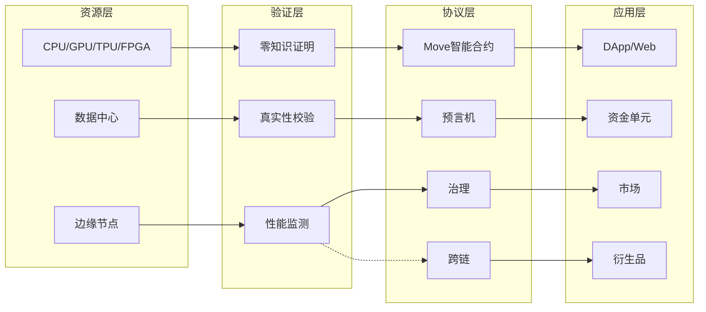
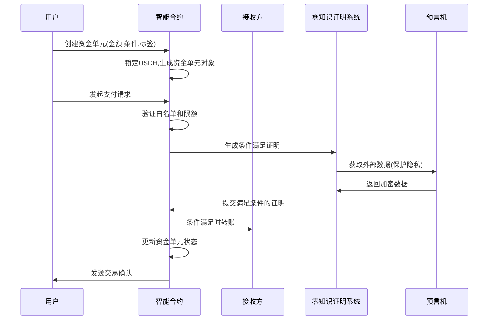
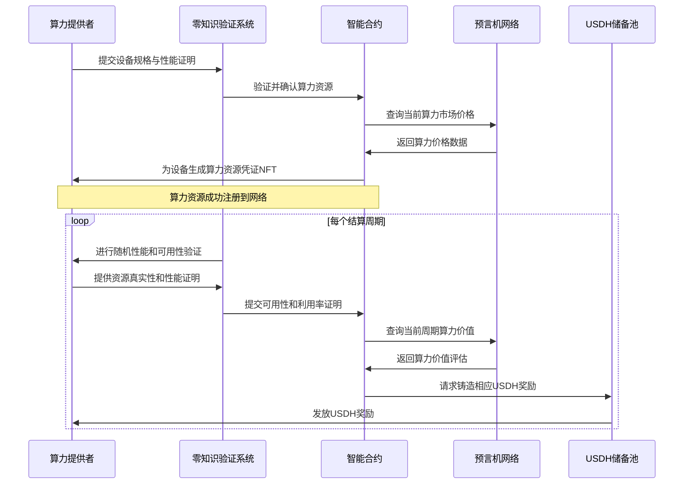

# USDH: 基于 Sui 区块链的算力支持可编程稳定币系统

## 1. 执行摘要

USDH（Hashrate-backed USD）是一个革命性的金融产品，基于 Sui 区块链构建，将分布式计算资源与稳定币技术深度融合，创建了一个多层资产支持的可编程数字货币生态系统。USDH不仅提供价值存储媒介，还将闲置算力资源代币化，解决了算力市场流动性低、定价不透明和资源浪费的行业痛点。

随着AI训练、区块链网络和云服务的爆发式增长，算力已成为数字经济的核心生产要素。然而，现有算力市场存在严重割裂，缺乏标准化度量和有效的价值捕获机制。USDH利用 Sui 区块链的对象模型和高性能特性，结合零知识证明增强的去中心化预言机网络，构建了全球首个算力资源标准化协议，实现了实用性资产与金融系统的无缝连接。

## 2. 系统架构与运行机制

### 2.1 多层架构设计

USDH系统采用四层分层设计，结合 Sui 区块链的对象模型和所有权系统，确保稳定性、可扩展性和安全性：



- **资源层**：由全球分布式的异质算力节点组成，包括通用计算、AI加速器、专用芯片等多样化资源。
- **验证层**：通过零知识证明和资源真实性验证确保所有贡献的算力资源真实可信。
- **协议层**：由 Sui 区块链上的 Move 智能合约、多源预言机网络和治理机制组成，利用 Sui 的对象模型和并行执行引擎，确保资源的高效发现、定价和交易。
- **应用层**：包括资金单元、算力交易市场、金融衍生品和合成资产市场，提供完整生态系统。

### 2.2 多层次资产支持模型

USDH采用创新的多层次金融模型，利用 Sui 的对象模型实现高效资产管理：

1. **稳定币锚定层**：每个USDH稳定币由等值的稳定资产（USDT/USDC）作为基础流动性支持，通过 Sui 的对象模型实现精确追踪
2. **算力资产层**：抵押的稳定币用于购买或租赁标准化算力单元，通过 Move 智能合约实现算力使用权的链上映射，利用 Sui 的动态字段特性支持灵活的资产属性扩展
3. **合成资产层**：基于算力资产构建的金融衍生品，利用 Move 的类型系统和泛型设计更安全的金融产品
4. **跨链抵押层**：利用 Sui 的高吞吐量和即时确定性，支持多链资产作为额外抵押，增强系统稳定性和扩展性

这种多层架构结合 Sui 的对象所有权模型，确保了USDH既有传统稳定币的价格稳定性，又具备实用价值算力资产的增值潜力和使用价值。

### 2.3 零知识增强的去中心化算力定价机制

系统设计了首个基于零知识证明的去中心化算力资源定价标准，结合 Sui 的对象模型实现创新的耗散性流动性池概念：

1. **耗散性流动性池设计**
- 基于 LooPIN 协议的研究，引入α（质押费率）、β（维护燃烧率）和γ（奖励率）三个核心参数
- 遵循平衡条件：γT₁ = α + βT，其中T为质押总时长，T₁为有效服务时间
- 通过动态调整确保最小质押期 Tmin = α/(γ-β)，维持系统长期稳定性
- 利用 Sui 的对象模型和动态字段实现高效的资源状态管理和更新

2. **多维度定价机制**
- 基础定价：使用 FLOPS·小时作为通用计算单位
- 动态调整：利用 Sui 的即时确定性特性，根据市场需求、网络负载和能源效率进行实时价格调整
- 时间衰减：未使用算力资源按照预设衰减率折损，反映资源时效性，通过 Sui 的高性能交易处理实现精确计算
- 资源评分：利用动态字段存储和更新资源的综合性能、可靠性、能效和历史表现评分

3. **预言机网络优化**
- 分布式数据采集：利用 Sui 的即时确定性提供更频繁的市场数据更新
- 加权共识模型：基于历史准确性动态调整不同数据源权重
- 异常检测：采用统计模型自动识别和过滤异常数据点
- 深度时间加权：扩展传统TWAP机制，增强价格稳定性

4. **智能定价调节**
- 市场需求因子：反映当前算力需求强度
- 网络负载因子：平衡网络整体资源利用率
- 能源效率因子：激励高能效算力资源的使用
- 历史表现权重：基于历史服务质量调整定价

5. **资源评分系统**
- 性能评分：计算性能和响应速度
- 可靠性评分：服务稳定性和可用性
- 能源评分：能源使用效率
- 历史评分：长期服务质量记录

该定价机制结合 Sui 的高性能特性，确保算力资源价格准确反映市场供需关系，同时通过耗散性流动性池设计抵抗多种形式的市场操纵。

### 2.4 自适应稳定机制

USDH采用先进的自适应稳定机制，结合 Sui 的对象模型和即时确定性维持其与美元的1:1锚定：

1. **动态抵押率调整**
- 基于市场波动性自动调整抵押率要求（130%-200%范围内）
- 使用贝叶斯统计模型预测最优抵押水平
- 通过零知识证明验证统计模型计算正确性，保护敏感市场数据
- 利用 Sui 的即时确定性特性实现更快速的抵押率调整

2. **分层算力储备池**
- 全局算力资源储备分为多个风险等级的池子
- 按流动性和稳定性分类，精确应对不同市场情境
- 零知识审计提供透明度而不暴露具体资源细节
- 利用 Sui 的对象模型实现更精细的资源池管理

3. **反周期费率机制**
- 自动对抗市场周期性波动
- 在市场需求高时提高铸造成本，需求低时降低赎回成本
- 费率调整基于多维价格反馈网络，使用神经网络模型
- 利用 Sui 的高吞吐量处理大量价格数据分析

4. **流动性激励系统**
- 为关键价格区间的流动性提供者提供额外奖励
- 确保价格稳定性和深度市场流动性
- 奖励计算透明且可验证
- 利用 Sui 的并行执行特性处理大量流动性提供者的奖励计算

## 3. 资金单元与可编程性

USDH的核心创新是"资金单元"模型，这是一种通用的可编程资金管理机制，结合 Sui 的对象模型和所有权系统，能够对资金流向、使用条件和授权规则进行精确控制，而不仅限于算力资源分配。

### 3.1 增强型资金单元结构

每个资金单元表现为 Sui 区块链上的对象，包含以下通用组件：

```move
struct FundUnit has key {
    id: UID,
    original_owner: address,
    current_owner: address,
    amount: u64,
    purpose_tags: vector<String>,
    release_time: u64,
    transferable: bool,
    white_list: vector<address>,
    black_list: vector<address>,
    daily_limit: u64,
    max_transfer: u64,
    condition_metadata: String,
    is_loan: bool,
    is_repaid: bool,
    meta_fields: Option<ID>,  // 动态字段容器
    audit_trail: vector<TransactionRecord>,
    authorized_signers: vector<address>,
    quorum_threshold: u8,
    expiration_policy: u8,
    privacy_level: u8,
    conditional_logic: Option<String>,
}
```

### 3.2 高级资金控制策略

资金单元支持多种资金流向和用途控制策略，利用 Sui 的特性实现更高效的控制：

1. **动态访问控制**：利用 Sui 的对象能力模型，根据资金使用方的历史行为、信誉分数和上下文环境动态调整权限
2. **分层授权机制**：利用 Move 的类型安全特性，设定多级审批流程，不同金额阈值触发不同的授权要求
3. **条件组合逻辑**：支持复杂的条件表达式，如(A AND B) OR (C AND D)形式的授权逻辑
4. **时间锁定变体**：支持线性释放、阶梯释放、条件触发释放等多种时间锁定模式，利用 Sui 的即时确定性实现精确的时间控制
5. **跨链资金传递**：利用 Sui 的高吞吐量，允许资金单元触发其他区块链上的资金操作，实现高效的跨链资金流动
6. **隐私保护控制**：选择性披露交易细节，保护敏感业务信息

### 3.3 零知识资金单元流程



### 3.4 应用场景示例

#### 企业财资管理

**问题**：企业面临大量单笔金额低、频次高、供应商众多的小额零散采购，传统支付方式手续费高、对账困难

**USDH解决方案**：
- 财务部门为各项目、子团队开设子账户（创建资金单元对象）
- 在资金单元动态字段中预设白名单供应商地址集与额度控制字段
- 员工直接通过链上接口向供应商转账，系统自动校验并执行
- 零知识证明确保交易合规性的同时保护商业敏感信息
- 所有交易实时记录，利用 Sui 的高性能特性支持全自动对账和报表生成

#### 合约级资金交付约定

**问题**：传统合同执行缺乏技术性约束，容易发生违约或执行不力

**USDH解决方案**：
- 委托方创建资金单元时设定释放期限和自动检测条件
- Move 智能合约结合零知识证明自动监控条件满足情况
- 利用 Sui 的即时确定性特性，条件满足时自动释放资金；期限到达条件未满足则自动回收
- 资金在释放前锁定，委托方无法撤回，确保交付承诺
- 支持复杂的条件逻辑表达式，如(完成任务A AND 通过质量审核) OR (部分完成 AND 时间到期)

#### 风险资金防护

**问题**：传统金融系统难以有效防范资金流向高风险目标

**USDH解决方案**：
- 系统维护全局风险地址集(blacklist)
- 每次转账前自动检查目标地址是否在黑名单中
- 使用机器学习模型实时分析交易模式，识别可疑行为
- 发现风险立即拦截并通知相关方
- 社区治理机制动态更新风险地址集
- 利用 Sui 的高吞吐量支持实时交易风险分析

#### 高级薪资管理

**问题**：传统薪资发放流程繁琐，缺乏灵活性和个性化

**USDH解决方案**：
- 企业创建时间锁定的薪资资金单元，支持多种释放模式
- 设定复合条件的薪资结构：基本工资、绩效奖金、团队奖励等
- 支持员工自定义分配：部分转入储蓄、部分用于投资、部分直接使用
- 内置税务合规性验证，自动计算和预留税款
- 所有发放记录链上透明，自动生成工资单
- 利用 Sui 的动态字段特性支持灵活的薪资结构设计

### 3.5 与算力资源整合

资金单元作为通用机制，可与多种类型的算力资源无缝整合，利用 Sui 的对象模型实现更高效的资源管理：

- **异质算力资源支持**：利用 Move 的泛型特性，同时支持GPU、CPU、TPU、FPGA等多种计算硬件类型
- **工作负载特定分配**：基于具体AI模型、科学计算类型等需求精确匹配算力
- **资源效率验证**：通过零知识证明验证算力资源是否按承诺提供服务
- **质量差异化定价**：根据硬件性能、可靠性和服务质量区分定价
- **碳足迹追踪**：利用 Sui 的动态字段特性，记录和优化计算资源的能源使用，支持绿色计算选项

## 4. 零知识证明与高级安全架构

### 4.1 多层次计算安全机制

USDH系统采用综合安全架构，结合 Sui 区块链的安全特性：

1. **可信执行环境(TEE)**：敏感计算在Intel SGX或AMD SEV等硬件隔离环境中进行
2. **零知识证明(ZKP)验证网络**：
   - **资源证明**：验证节点实际拥有声明的算力资源
   - **计算正确性证明**：证明计算结果正确而无需暴露输入数据
   - **性能承诺证明**：证明节点履行了服务等级协议(SLA)
3. **密态数据处理**：
   - **联邦学习框架**：允许节点参与训练而不共享原始数据
   - **同态加密计算**：支持全同态加密(FHE)实现加密状态下的计算
   - **安全多方计算(MPC)**：实现多方数据协作而不暴露原始数据
4. **隐私分析框架**：
   - **差分隐私**：为数据分析添加精确校准的噪声，保护个体隐私
   - **可验证延迟函数(VDF)**：防止前置运行和交易顺序操纵

### 4.2 零知识审计与合规

1. **可验证资源核算**：使用递归零知识证明实现高效的资源使用验证
2. **隐私保护审计**：允许监管审计而不暴露敏感业务数据
3. **合规性证明**：自动生成法规遵从性的零知识证明
4. **去信任验证机制**：任何人都可以验证系统运行的正确性，无需信任中心化机构
5. **Sui原生安全增强**：利用 Move 语言的形式化验证特性提供更强的安全保障

## 5. 合成资产与衍生品市场

### 5.1 算力合成资产

**创新点**：利用 Sui 的对象模型和动态字段，将算力资源代币化为合成资产，实现灵活交易和组合

**机制设计**：
- **算力期货**：表示未来特定时间点的算力使用权，利用 Sui 的即时确定性特性实现精确的时间控制
- **算力期权**：获得以特定价格购买算力的权利，利用 Move 的类型安全特性设计更安全的金融产品
- **算力收益率产品**：基于算力资源收益率的结构化产品，利用动态字段存储复杂的收益结构
- **算力指数**：追踪特定算力类型市场表现的指数，利用 Sui 的高吞吐量处理大量市场数据

### 5.2 交叉抵押融资

**创新点**：支持多种资产作为交叉抵押，利用 Sui 的对象模型优化资本效率

**机制设计**：
- 允许将算力资产与其他数字资产组合作为抵押，利用 Sui 的对象模型实现灵活的资产组合
- 动态调整不同资产的抵押率，基于风险相关性
- 智能清算保护机制，利用 Sui 的即时确定性实现更精确的清算条件监控
- 零知识隐私抵押，保护抵押人的资产组合信息

### 5.3 算力衍生品市场

**创新点**：利用 Sui 的高性能特性构建完整的算力金融生态系统

**机制设计**：
- **算力永续合约**：无到期日的算力价格合约，利用 Sui 的并行执行特性处理大量市场参与者
- **算力掉期**：交换不同类型算力资源的协议，利用 Move 的类型系统确保安全交换
- **算力结构化产品**：自动化的算力投资策略，利用动态字段存储复杂的产品结构
- **计算资源ETF**：多种算力资源的组合投资工具，利用 Sui 的对象模型实现高效资产管理

## 5. 算力贡献挖矿(Compute-to-Earn)机制

USDH系统创新性地引入"算力贡献挖矿"(Compute-to-Earn)机制，利用 Sui 的高性能和对象模型，使算力提供者可以通过贡献计算资源直接赚取USDH稳定币，形成完整的生态闭环：

### 5.1 算力贡献挖矿流程



### 5.2 耗散性算力流动性池

USDH系统采用"耗散性算力流动性池"概念，利用 Sui 的对象模型和动态字段实现高效资源管理：

1. **资源时效性**：计算资源无法存储，未使用的算力会随时间"耗散"，这一特性通过 Sui 的对象模型和动态状态更新实现精确建模
2. **双重奖励结构**：
   - **基础可用性奖励**：只要算力资源保持在线且通过验证，提供者即可获得基础USDH奖励，补偿维护成本
   - **使用率奖励**：资源被实际使用时，提供者获得额外USDH奖励，与实际计算任务成正比
3. **动态铸造与平衡**：系统根据以下因素动态决定为算力贡献铸造的USDH数量：
   - 当前算力市场价值(通过预言机网络)
   - 资源实际使用率和性能
   - 系统整体抵押率目标
   - 全局USDH流通供应量

### 5.3 维持稳定的经济模型

为确保USDH价值稳定，系统采用精确的经济平衡模型，结合 Sui 的高性能特性实现实时调整：

1. **价值锚定**：每个通过算力贡献铸造的USDH由等值的算力资源支持，并有系统储备资产作为额外保障
2. **动态调整参数**：
   - α (质押要求)：算力提供者需要满足的初始质押要求
   - β (维护成本率)：资源在线维护的成本比率，影响基础奖励
   - γ (奖励率)：资源被使用时的奖励比率
3. **资源评级系统**：基于历史表现、可靠性和资源质量的综合评级，影响奖励系数
4. **平衡条件**：遵循 γ·T₁ = α + β·T 的平衡原则，确保系统长期经济稳定

这种算力贡献挖矿机制结合 Sui 的高性能和对象模型，不仅有效激励全球闲置算力资源加入USDH网络，还通过零知识证明保障所有资源真实可用，为USDH稳定币提供了实际算力资产支持。

## 6. 高级技术实现路径

### 6.1 Sui 特有技术栈

- **区块链层**：Sui 区块链的高吞吐量和即时确定性
- **智能合约**：Move 语言与零知识编译器集成，利用 Move 的形式化验证特性提供更强的安全保障
- **算力证明**：基于SnarkPack的高效递归证明系统
- **预言机网络**：去中心化多签验证的加密数据馈送，利用 Sui 的即时确定性提供更频繁的更新
- **前端界面**：WebAssembly优化的React应用与原生移动客户端

### 6.2 Sui 技术优势应用

1. **对象模型优化**：利用 Sui 的对象模型和所有权系统，实现更精确的资源表示和管理
2. **动态字段应用**：为算力资源和资金单元添加灵活的属性和条件
3. **并行执行引擎**：利用 Sui 的并行执行特性，提升系统整体吞吐量和响应速度
4. **跨链资产桥**：利用 Sui 的高性能特性，支持多链资产的高效无信任流动
5. **链上机器学习引擎**：实现复杂的实时风控和资源优化

## 7. 自治治理与经济模型

### 7.1 全景式去中心化治理

USDH系统由持币者组成的DAO共同治理，利用 Sui 的高性能特性支持大规模治理参与：

- **分域治理**：将系统分为技术、金融、风控等多个治理域，专业化决策
- **平方投票机制**：投票权重与质押时间的平方成正比，鼓励长期持有
- **治理代币**：USDH-GOV代表治理权，基于贡献度和质押量分配
- **提案流程引擎**：自动化提案管理流程，提高治理效率
- **链下共识+链上执行**：结合社区讨论与链上投票，平衡效率与安全

### 7.2 多层激励经济模型

系统设计了精细的多层激励机制，确保各参与方利益一致：

1. **算力提供奖励**：节点贡献算力获得USDH基础奖励与使用费分成
2. **渐进式信誉系统**：历史表现直接影响未来收益，鼓励长期稳定服务
3. **生态建设基金**：协议收入的20%用于资助生态系统发展
4. **验证者网络**：特殊节点负责验证算力资源质量，获得额外奖励
5. **开发者激励计划**：为生态系统开发者提供代码贡献奖励和使用费分成
6. **社区教育补贴**：激励社区成员创建教育内容，扩大生态影响力

## 8. 扩展路线图与技术愿景

### 8.1 五阶段发展路线

1. **基础构建阶段（2025 Q1-Q2）**
   - 开发基于 Move 语言的核心合约系统
   - 构建跨平台节点客户端
   - 建立初始预言机网络与验证者网络

2. **验证网络阶段（2025 Q3-Q4）**
   - 测试网部署并招募早期算力提供者
   - 实现基础资金单元功能与零知识审计
   - 完成全面安全审计与形式化验证

3. **主网上线阶段（2026 Q1-Q2）**
   - 主网正式启动
   - 实现跨链资产桥接
   - 开放开发者API与SDK

4. **生态扩展阶段（2026 Q3-Q4）**
   - 推出合成资产与衍生品市场
   - 建立全面的跨链互操作性
   - 实现完全去中心化治理

5. **全球规模阶段（2027+）**
   - 支持数百万节点的全球算力网络
   - 实现算力资源的标准市场定价机制
   - 与传统云计算和金融系统深度整合

### 8.2 创新技术愿景

USDH系统旨在成为全球算力资源的标准度量和交易协议，利用 Sui 区块链的高性能和创新特性，构建一个无许可的计算经济生态系统。长期技术愿景包括：

- **量子抗性架构**：提前设计应对量子计算威胁的密码学升级路径
- **自主AI治理辅助**：通过AI增强的治理工具提高决策效率
- **实体经济整合**：将算力资源与实体经济的供应链和金融系统深度整合
- **绿色计算激励**：优先调度和奖励能源效率高的算力资源，推动行业可持续发展

## 9. 加入全球创新生态

USDH项目正在积极发展全球合作网络：

- **算力提供者**：数据中心、GPU农场、边缘计算节点
- **技术合作伙伴**：零知识证明研究团队、区块链基础设施提供商
- **应用开发者**：构建垂直行业解决方案
- **研究合作**：与学术机构共同探索算力经济学与密码学前沿
- **企业用户**：需要高性能计算的AI创业公司与研究机构

联系我们: contact@usdh.network | [Website](https://usdh.network)